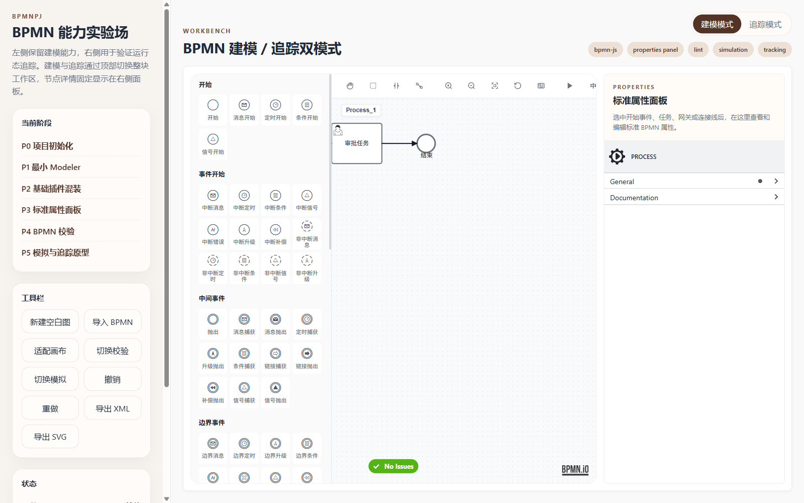

# BPMN Studio Workbench / BPMN 能力实验场

一个基于 `bpmn-js` 的 BPMN 建模、插件实验和运行态追踪工作台。项目目标是把 BPMN 建模器、常用插件、自定义 Palette、属性面板、主题渲染和追踪视图沉淀成一个可以独立维护、二次开发和开源展示的前端项目。

A BPMN modeling, plugin experimentation, and runtime tracking workbench built on top of `bpmn-js`. The goal is to provide a standalone frontend project for exploring BPMN authoring, custom palettes, properties panel extensions, themed rendering, validation, simulation, and tracking views.



## Features / 功能

- BPMN modeler powered by `bpmn-js`.
- Custom grid palette with expanded BPMN element variants.
- Standard properties panel via `bpmn-js-properties-panel`.
- Custom properties extension for workflow-oriented metadata.
- BPMN linting via `bpmn-js-bpmnlint`.
- Token simulation via `bpmn-js-token-simulation`.
- Element color editing via `bpmn-js-color-picker`.
- Native copy and paste support with a local fallback module.
- Minimap and grid support via `diagram-js-minimap` and `diagram-js-grid`.
- Chinese / English UI switching through a custom translate module.
- Custom BPMN rendering and studio-oriented theme overrides.
- Tracking mode with a read-only viewer, node details, status markers, and event logs.

---

- 基于 `bpmn-js` 的 BPMN 建模器。
- 自定义四宫格 Palette，将小扳手里的常用元素变体直接展开到侧边栏。
- 集成标准属性面板 `bpmn-js-properties-panel`。
- 提供面向工作流元数据的自定义属性扩展。
- 集成 `bpmn-js-bpmnlint` 做 BPMN 校验。
- 集成 `bpmn-js-token-simulation` 做流程模拟。
- 集成 `bpmn-js-color-picker` 给节点和连线改颜色。
- 集成原生复制粘贴，并提供本地兜底模块。
- 集成 `diagram-js-minimap` 和 `diagram-js-grid`。
- 通过自定义 translate 模块支持中文 / 英文切换。
- 提供自定义 BPMN 渲染和工作台主题覆盖。
- 提供追踪模式，用只读 viewer 展示运行态流程、节点详情和事件日志。

## Quick Start / 快速开始

```bash
npm install
npm run dev
```

Open:

```text
http://localhost:5173/
```

Build:

```bash
npm run build
```

Smoke check:

```bash
npm run smoke
```

---

本地启动：

```bash
npm install
npm run dev
```

默认地址：

```text
http://localhost:5173/
```

生产构建：

```bash
npm run build
```

结构烟测：

```bash
npm run smoke
```

## Project Structure / 项目结构

```text
src/
  app/                 app bootstrap, templates, lifecycle, view and toolbar controllers
  lint/                BPMN lint configuration
  modeler/             modeler creation, modules, palette, events, status, diagram actions
  styles/              app styles and BPMN studio theme overrides
  tracking/            tracking viewer controller, events, tabs, selection, scenarios and rendering
  viewer/              tracking viewer factory
docs/
  assets/              screenshots and documentation assets
  architecture.md      architecture notes
  plugin-guide.md      plugin extension guide
```

```text
src/
  app/                 应用启动、模板、生命周期、视图切换和工具栏控制
  lint/                BPMN lint 配置
  modeler/             建模器创建、模块注册、Palette、事件、状态和图形动作
  styles/              应用样式与 BPMN Studio 主题覆盖
  tracking/            追踪 viewer 控制、事件、页签、节点选择、场景和渲染
  viewer/              追踪 viewer 工厂
docs/
  assets/              截图和文档资源
  architecture.md      架构说明
  plugin-guide.md      插件扩展指南
```

## Plugin Matrix / 插件能力

| Capability | Package / Module |
| --- | --- |
| BPMN modeling | `bpmn-js` |
| Properties panel | `bpmn-js-properties-panel` |
| BPMN lint | `bpmn-js-bpmnlint`, `bpmnlint` |
| Token simulation | `bpmn-js-token-simulation` |
| Color picker | `bpmn-js-color-picker` |
| Native copy/paste | `bpmn-js-native-copy-paste` |
| Grid | `diagram-js-grid` |
| Minimap | `diagram-js-minimap` |
| Custom palette | `src/modeler/palette/` |
| Custom rendering | `src/modeler/custom-rendering/` |
| Custom rules | `src/modeler/rules/` |
| Tracking viewer | `src/tracking/`, `src/viewer/` |

## Architecture Notes / 架构说明

The app is intentionally split into small modules:

- `src/app/workbench.js` creates and wires the modeler, viewer, controllers, and lifecycle.
- `src/modeler/modules.js` declares all enabled modeler plugins.
- `src/modeler/palette/paletteEntries.js` keeps the BPMN palette element list configurable.
- `src/modeler/events.js`, `status.js`, and `diagramActions.js` separate event binding, UI status, and diagram IO.
- `src/tracking/controller.js` is a thin assembly layer for tracking mode.
- `src/tracking/events.js`, `selection.js`, `tabs.js`, and `scenarioView.js` split tracking interactions and rendering responsibilities.

---

项目按职责拆分为小模块：

- `src/app/workbench.js` 负责创建并组装 modeler、viewer、控制器和生命周期。
- `src/modeler/modules.js` 声明建模器启用的所有插件。
- `src/modeler/palette/paletteEntries.js` 集中配置左侧 BPMN 元素清单。
- `src/modeler/events.js`、`status.js`、`diagramActions.js` 分别处理事件绑定、状态展示和图形导入导出。
- `src/tracking/controller.js` 是追踪模式的薄组装层。
- `src/tracking/events.js`、`selection.js`、`tabs.js`、`scenarioView.js` 拆分追踪交互和渲染职责。

## Screenshot / 截图

The screenshot in this README was captured from the local dev server with Playwright.

README 中的截图来自本地开发服务，并通过 Playwright 截取。

```text
docs/assets/bpmn-studio-modeler.png
```

## Development Guidelines / 开发约定

- Keep behavior stable before refactoring.
- Prefer small modules with explicit ownership.
- Register new BPMN extensions through `src/modeler/modules.js`.
- Add or reorder palette entries through `src/modeler/palette/paletteEntries.js`.
- Keep tracking-only logic under `src/tracking/`.
- Run `npm run smoke` before committing.

---

- 重构前先保证已有行为稳定。
- 优先使用职责明确的小模块。
- 新增 BPMN 插件能力统一通过 `src/modeler/modules.js` 注册。
- 新增或调整左侧 Palette 元素优先修改 `src/modeler/palette/paletteEntries.js`。
- 追踪模式逻辑保持在 `src/tracking/` 目录下。
- 提交前运行 `npm run smoke`。

## Roadmap / 后续计划

- Add GitHub Actions for `npm ci && npm run smoke`.
- Add a formal `LICENSE`.
- Add Playwright browser smoke tests for mode switching, palette rendering, and properties panel visibility.
- Add more screenshots for tracking mode.
- Continue separating theme variables, layout styles, and BPMN override styles.

---

- 增加 GitHub Actions，执行 `npm ci && npm run smoke`。
- 补充正式 `LICENSE`。
- 增加 Playwright 浏览器级 smoke test，覆盖模式切换、Palette 渲染和属性面板显示。
- 补充追踪模式截图。
- 继续拆分主题变量、布局样式和 BPMN 覆盖样式。

## Documentation / 文档

- [Architecture](docs/architecture.md) / [架构说明](docs/architecture.md)
- [Plugin Guide](docs/plugin-guide.md) / [插件扩展指南](docs/plugin-guide.md)
- [Plugin Matrix](docs/plugin-matrix.md) / [插件矩阵](docs/plugin-matrix.md)
